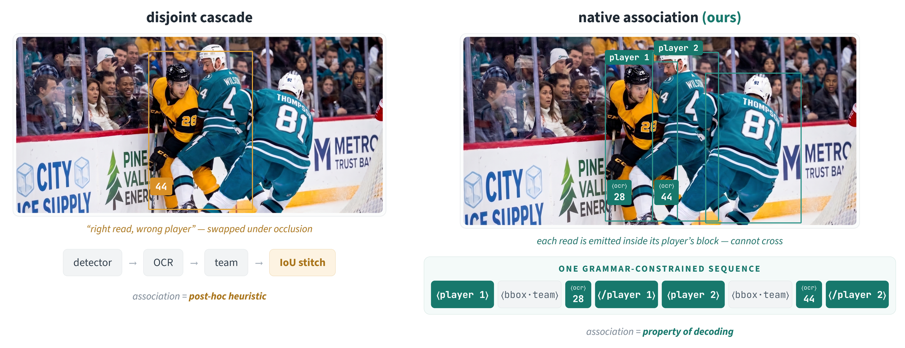
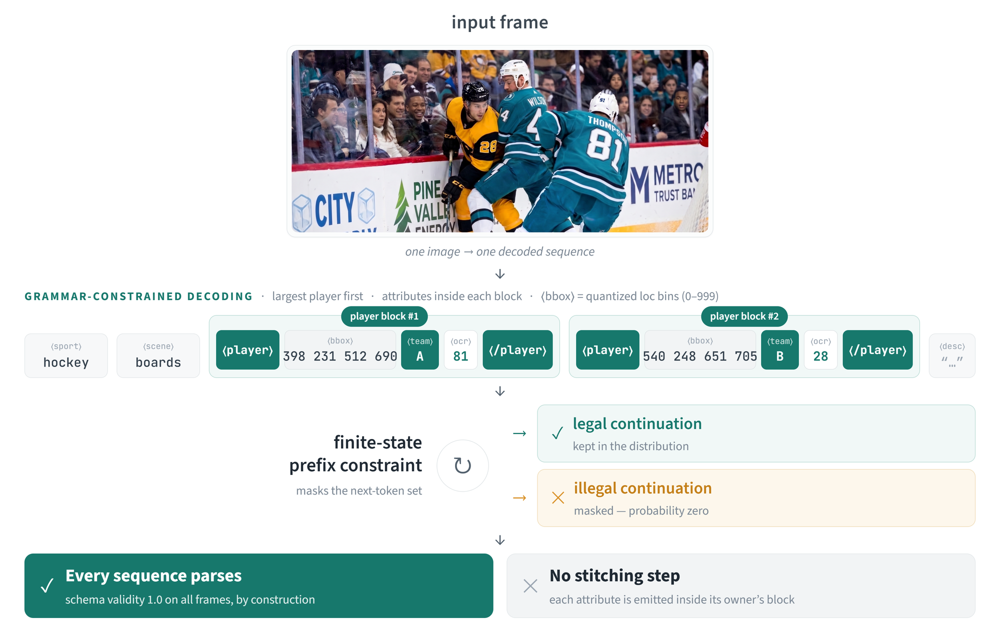

# Native Association

> Recipe release for **"Native Association: Confidence-Aware Human Perception in the Wild with a Foundation VLM"** — Igal Dmitriev & Ofir Liba (WSC Sports), 1st Workshop on Human-Centered Multimodal Intelligence in the Wild (**HCMIW @ ECCV 2026**), Malmö, Sept 8. [Paper + reviews on OpenReview](https://openreview.net/forum?id=ZYKiyXfSy8).



Extracting *who is where, on which team, wearing which number* from a broadcast frame is normally done by stitching a detector, an OCR engine and classifiers together — and under occlusion the stitch attaches a correctly read number to the **wrong** athlete. This recipe removes the failing joint: a **finite-state grammar** under which a 0.77B VLM (Florence-2) emits *all* per-entity attributes inside each owner's block of **one** decoded sequence — so association is a property of decoding, every frame is schema-valid **by construction**, and one extra forward pass yields a **per-field confidence** with a working reject option.

This is a **recipe, not a code release** — the same philosophy as [florence2-unified-perception](https://github.com/Igal20/florence2-unified-perception): prose written so you can hand it, together with your dataset description, to your coding assistant (Claude Code, Cursor, …) and scaffold a working system **on your own data**. Five reference `.py` files pin down only the parts that are easy to get subtly wrong.

| If you want to... | Go to |
|---|---|
| **Reproduce the method on your own dataset** | [`recipe/`](recipe/) — start at [`recipe/README.md`](recipe/README.md), then hand `recipe/docs/` + `reference/` to your coding assistant |
| **Read the exact reference implementations** (grammar, serializer, parser, confidence replay, metrics) | [`reference/`](reference/) — 5 files, public deps only |
| **Read the paper / supplementary / poster** | [`paper/`](paper/) |
| **Re-run the API baselines with the exact prompt** | [`prompts/gemini_prompt_eccv_v1.md`](prompts/gemini_prompt_eccv_v1.md) |
| **Reproduce the public-benchmark numbers** | **[WIDER-Attribute checkpoint on Hugging Face](https://huggingface.co/Igal20/native-association-wider-florence2)**; see [`docs/REPRODUCING.md`](docs/REPRODUCING.md) |

## The recipe in one table

| Failure axis | Mechanism | Result |
|---|---|---|
| Syntactic validity | finite-state grammar over decoding | schema-valid **1.0** on every frame, by construction |
| Semantic association | attributes emitted *inside* the owner's block | jersey-digit AER **0.057** vs zero-shot frontier APIs' 0.21–0.24 (~4× lower) |
| Visual grounding (small entities) | confidence-routed, training-free crop re-query | tiny-bucket jersey F1 **0.61 → 0.75** |
| Reliability | one **unmasked** teacher-forced replay (Eq. 1) | AUROC 0.879; jersey precision **0.71 → 0.96** at half coverage |

On a frozen 567-frame multi-sport test the single pass reaches **0.95 detection F1** (prompted Gemini-2.5/3.1-pro: 0.65–0.75) at 1.2 s/frame (APIs: 8–26 s). Transplanted unchanged to public **WIDER-Attribute**: **93.1 mAP** given-box, **84.5 mAP** end-to-end — to our knowledge the first detection-coupled result under its standard protocol. And the finding that shapes the recipe: once the grammar is learned, further parameter-efficient tuning showed **no measurable gain** under the tested configurations — the gains live in the structure, not in added weights.



## Recipe contents

* [`recipe/README.md`](recipe/README.md) — landing page: why, the guarantees, the LLM-scaffolding workflow.
* [`recipe/docs/SCHEMA_AND_GRAMMAR.md`](recipe/docs/SCHEMA_AND_GRAMMAR.md) — the annotation contract and the full grammar state table, including the two decode-default traps.
* [`recipe/docs/TRAINING.md`](recipe/docs/TRAINING.md) — the deliberately plain recipe, the pre-registered noise floor, and what NOT to spend time on (the measured LoRA null).
* [`recipe/docs/CONFIDENCE_AND_REQUERY.md`](recipe/docs/CONFIDENCE_AND_REQUERY.md) — Eq. 1, why the replay must be unmasked, the reject option, the re-query and its honestly-stated cost.
* [`recipe/docs/EVALUATION.md`](recipe/docs/EVALUATION.md) — the suite, AER + decomposition, frozen-test discipline, bootstrap.
* [`recipe/docs/ADAPT_TO_YOUR_DOMAIN.md`](recipe/docs/ADAPT_TO_YOUR_DOMAIN.md) — the five-step port, the WIDER worked example, the honesty checklist.

## Release scope

The sports corpus and sports checkpoint are proprietary (WSC Sports production data) and are **not** released. Released here: the complete methodology, the five reference implementations, the verbatim baseline prompts, the paper artifacts — and the **[WIDER-Attribute checkpoint](https://huggingface.co/Igal20/native-association-wider-florence2)** (Hugging Face), which makes the public-benchmark results reproducible end-to-end. Status per artifact: [`docs/REPRODUCING.md`](docs/REPRODUCING.md).

## Citation

```bibtex
@inproceedings{dmitriev2026native,
  title     = {Native Association: Confidence-Aware Human Perception in the Wild with a Foundation VLM},
  author    = {Dmitriev, Igal and Liba, Ofir},
  booktitle = {ECCV Workshops (Human-Centered Multimodal Intelligence in the Wild)},
  year      = {2026}
}
```

## License

MIT — see [LICENSE](LICENSE).
