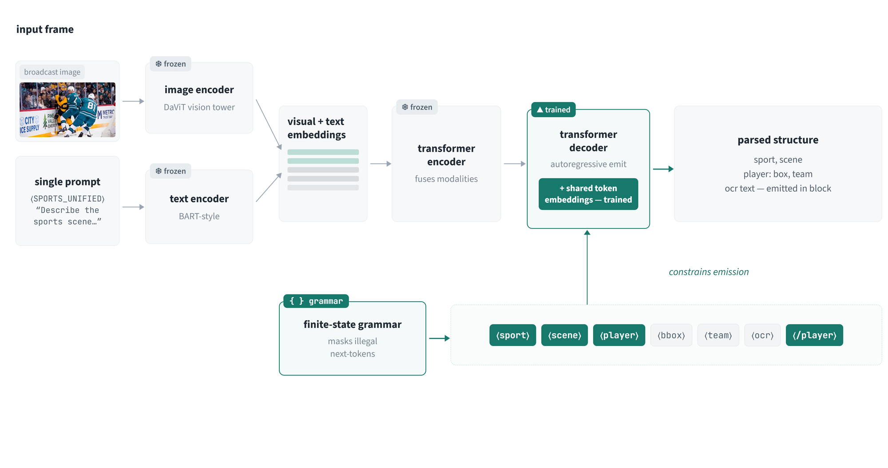
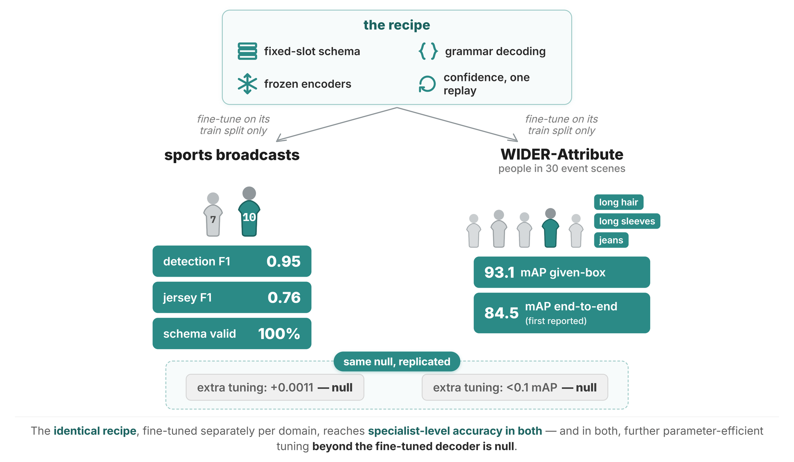

# The Native Association recipe

**Goal:** fine-tune a small vision–language model (we use Florence-2-large, 0.77B) so that it emits *every* per-entity attribute of an image inside that entity's block of **one grammar-constrained sequence** — making entity–attribute **association a property of decoding**, guaranteeing **schema-valid output on every frame by construction**, and getting a **per-field confidence** from one extra forward pass.

This is a **recipe release, not a code release**. The five files in [`reference/`](../reference/) are working reference implementations of the parts that are easy to get subtly wrong; everything else is prose written so that you — or your coding assistant — can scaffold runnable training and inference scripts for *your* dataset.

## Why you'd want this

If your pipeline today is *detector → OCR/classifiers → IoU stitching*, then under occlusion the stitch attaches correctly-read attributes to the wrong entity. On our benchmark, cascades granted **ground-truth boxes and one crop per athlete** still misbind 15–18% of the jersey digits they read. Prompted frontier APIs are worse: 90–97% of their misbindings are reads grounded to no entity at all. The recipe removes the failing joint instead of improving its parts.

Three guarantees, one mechanism each:

| Failure axis | Mechanism | Result (paper) |
|---|---|---|
| Syntactic validity | finite-state grammar over decoding | schema-valid **1.0**, every frame, by construction |
| Semantic association | attributes emitted *inside* the owner's block | jersey-digit AER **0.057** vs APIs' 0.21–0.24 |
| Visual grounding (small entities) | confidence-routed crop re-query | tiny-bucket jersey F1 **0.61 → 0.75** |

And the finding that shapes the whole recipe: once the grammar is learned, **further parameter-efficient tuning showed no measurable gain under the configurations we tested** (LoRA ladder to 3.15M params: < +0.0011). The gains live in the structure. Spend your effort on the schema, not on adapters.

## The workflow (same philosophy as [florence2-unified-perception](https://github.com/Igal20/florence2-unified-perception))

1. **Read the recipe yourself first** — grounds your intuition before you delegate.
2. **Design your annotation contract** — decide the exact string the decoder should emit for one image. This is the one piece of genuinely bespoke thinking. → [`docs/SCHEMA_AND_GRAMMAR.md`](docs/SCHEMA_AND_GRAMMAR.md)
3. **Hand the docs + `reference/` to your coding assistant** (Claude Code, Cursor, …) with your dataset description. The docs are written to be sufficient for scaffolding a serializer, a training script, and an inference script from prose alone.
4. **Train plainly.** Warm-started token embeddings, frozen encoders, uniform cross-entropy on the decoder. No curriculum, no loss weighting, no adapters. → [`docs/TRAINING.md`](docs/TRAINING.md)
5. **Decode under the grammar; replay for confidence; re-query the weak tail.** → [`docs/CONFIDENCE_AND_REQUERY.md`](docs/CONFIDENCE_AND_REQUERY.md)
6. **Evaluate like the paper** — including the association error rate, the metric that actually measures the thing this recipe fixes. → [`docs/EVALUATION.md`](docs/EVALUATION.md)

Porting beyond sports — including the WIDER-Attribute worked example whose checkpoint we release — is in [`docs/ADAPT_TO_YOUR_DOMAIN.md`](docs/ADAPT_TO_YOUR_DOMAIN.md).

## What the reference files are for

| File | What it pins down |
|---|---|
| [`reference/grammar.py`](../reference/grammar.py) | the structural tokens and the exact prefix-allowed-tokens state machine (states, budgets, first-token mask, termination) |
| [`reference/serializer.py`](../reference/serializer.py) | annotation → target string: validity gates, largest-first ordering, caps, the `?`-policy |
| [`reference/output_parser.py`](../reference/output_parser.py) | decoded string → records, plus schema-compliance checks |
| [`reference/confidence_replay.py`](../reference/confidence_replay.py) | the one-pass **unmasked** replay and Eq. 1 aggregation |
| [`reference/metrics.py`](../reference/metrics.py) | the full evaluation suite, including AER and its decomposition |

They import only public packages (`torch`, `numpy`, `scipy`, `Levenshtein`, `loguru`) and each is readable top-to-bottom.
